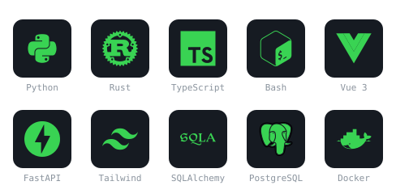

<a href="https://github.com/EstrellaXD">
  
</a>

```
╭─ estrella@zurich ──────────────────────────────╮
│  role      Postdoctoral Researcher             │
│  focus     Cancer & Single-cell Metabolism     │
│  lab       University Children's Hospital, CH  │
│  alma      PhD & BSc Chemistry, Tsinghua       │
│  stack     Python · Rust · TypeScript/Vue      │
│  known for Auto_Bangumi (7.9k★), SCMeTA        │
╰────────────────────────────────────────────────╯
```

---

## Tech Stack




---

## Featured Projects

### [Auto_Bangumi](https://github.com/EstrellaXD/Auto_Bangumi) &nbsp; 

全自动追番工具 | Fully automated anime tracking & downloading tool

`Python` `Docker` `RSS` `qBittorrent`

### [SCMeTA](https://github.com/SCMeTA/SCMeTA) &nbsp; 

A Python library for single-cell metabolism data analysis | 单细胞代谢数据分析工具

`Python` `Single-cell` `Metabolism`

### [SEED](https://github.com/EstrellaXD/SEED) &nbsp; 

Universal mass spectrometry file reader — fast, cross-platform, no .NET required

`Rust` `Python` `Mass Spectrometry`

---

## Selected Publications

- **Pan X**, Pan S, Du M, Yang J, Yao H, Zhang X, Zhang S. SCMeTA: a pipeline for single-cell metabolic analysis data processing. *Bioinformatics*, 40(9), btae545, 2024.
- Du M, **Pan X**, Peng Y, Yang J, Pan S, Cheng R, et al. A Tandem Cytometry Platform for Single-Cell Analysis of Protein and Metabolites. *Analytical Chemistry*, 97(13), 6962-6966, 2025.
- Yao H, Zhao H, Zhao X, **Pan X**, Feng J, Xu F, Zhang S, Zhang X. Label-free mass cytometry for unveiling cellular metabolic heterogeneity. *Analytical Chemistry*, 91(15), 9777-9783, 2019.
- Zhang XC, Zang Q, Zhao H, Ma X, **Pan X**, Feng J, Zhang S, Zhang R, Abliz Z, Zhang X. Combination of droplet extraction and Pico-ESI-MS allows the identification of metabolites from single cancer cells. *Analytical Chemistry*, 90(16), 9897-9903, 2018.

[Full publication list on Google Scholar](https://scholar.google.com/citations?user=A4pL4bsAAAAJ)

---

## GitHub Stats

<p>
  
  &nbsp;&nbsp;
  
</p>

<p>
  
</p>

---

## Activity Graph


---

## Contribution Snake

<picture>
  <source media="(prefers-color-scheme: dark)" srcset="https://raw.githubusercontent.com/EstrellaXD/EstrellaXD/dist/github-snake-dark.svg" />
  <source media="(prefers-color-scheme: light)" srcset="https://raw.githubusercontent.com/EstrellaXD/EstrellaXD/dist/github-snake.svg" />
  
</picture>
